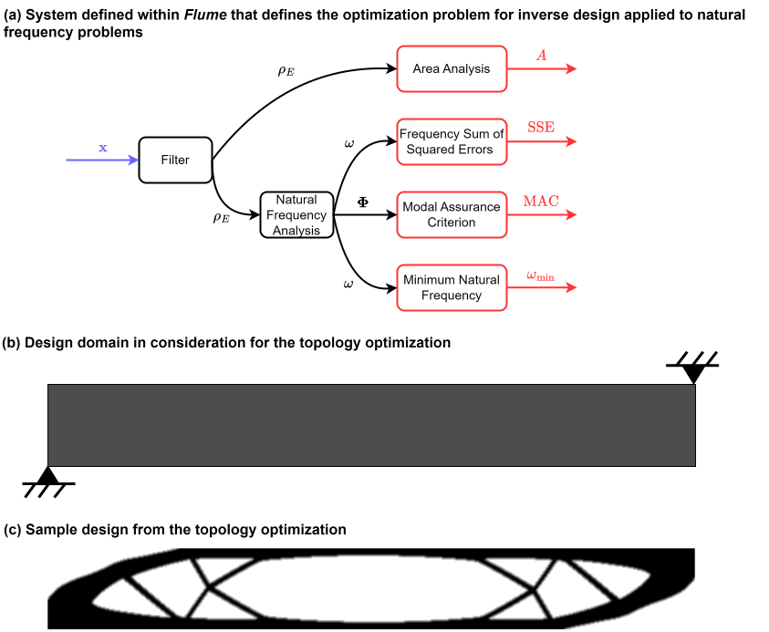

# Summary

In an effort to solve a variety of multidisciplinary optimization (MDO) problems with gradient-based techniques, we have developed a tool to facilitate the system-level construction and execution for both the forward and reverse analyses.
This framework, entitled _Flume_, is designed around systems that can be described by directed acyclic graphs (DAG).
While this specific architecture prevents systems that have coupled relationships, it is applicable for a wide variety of problems, including topology and trajectory optimization.
Following the DAG structure, each node represents an individual analysis that needs to be performed for the MDO problem, and the edges represent connections between analyses and denote the flow of information.
To ensure that the framework is extensible, lightweight, and minimalist, three base classes have been implemented in Python to capture the necessary functionality: _State_, _Analysis_, and _System_.
The first class, _State_, simply provides an object that stores numerical data along with some additional metadata, including type, shape, and object source information.
_Analysis_ is the foundation of Flume, and its primary task is to execute the forward and adjoint procedures to obtain the outputs and derivatives needed for optimization.
Finally, _System_ provides a set of methods to declare the objective function, constraints, and design variables that will be used within the optimization problem, as well as a means to visualize the DAG.
To utilize Flume, a user's primary responsibility is to construct the individual analyses, inherited from the _Analysis_ base class, that are needed for their _System_.
By adhering to a few architectural requirements when scripting these analyses, the framework's backend will automatically connect outputs to variables that share the same name.
This provides the user with a streamlined workflow, enabling them to focus on implementing new features and procedures instead of managing the integration.

The structure of _Flume_ is visualized in \autoref{fig:abstractsystem}, which depicts an abstracted _System_ that encapsulates four distinct _Analysis_ objects.
Arrows that link _Analysis_ objects denote _State_ objects that connect outputs of one discipline to variables of another.
_Analysis_ objects that are outlined in red and are labeled with "Top-level **_Analysis_** Object" are those that define output _States_ which are utilized for optimization.
Thus, the arrows that extend beyond the _System_ boundary are _States_ that define design variables, the objective function, or constraint functions for an optimization problem that is wrapped within the framework.

{width=100%}

# Statement of Need

Numerical optimization is a field with a diverse range of applications, and, in engineering, is often used as a means of formulating problems in a formal, mathematical manner to identify optimal designs.
The development of frameworks for organizing and solving these problems, which are often multidisciplinary in nature, is a topic that has been addressed by others in the past.
Investigations of these frameworks has exposed a set of requirements for MDO frameworks, including modularity, intuitive user interfaces, object-oriented principles, and minimal overhead [@salas1998framework, @padula2006multidisciplinary].
These attributes, among others, are critical components to ensuring that an MDO framework is extensible to a multitude of disciplines and accessible by a variety of individuals.
While there are many MDO frameworks that have been developed since the late 20th century, a few are listed below to highlight the current state of the art.

- _ASTROS_: one of the first examples of MDO frameworks, _ASTROS_ performs preliminary structural design using numerical optimization based on the finite-element method [@astros]
- _DAKOTA_: developed by Sandia National Laboratories, _DAKOTA_ is a software suite written in C++ that provides methods for a variety of analyses, including gradient-based and gradient-free optimization [@dakota]
- _Isight_: a commercial tool by Dassault Systèmes that utilizes and object-oriented approach to connect a variety of simulation-based models [@isight]
- _pyOptSparse_: an object-oriented solution written in Python, designed for solving constrained nonlinear optimization problems with sparsity that also supports parallelism [@Wu2020pyoptsparse]
- _OpenMDAO_: another open-source framework constructed within Python that utilizes gradient-based techniques for optimization of systems constructed with distinct components [@gray2019openmdao]

As evident from this list, users are presented with many viable options to perform numerical optimization for their system of interest.
_Flume_ provides another resource for those solving MDO problems, but it was particularly architected to facilitate gradient-based design optimization with the adjoint method.
For each _Analysis_ that a user wants to integrate into their model, they are responsible for providing the forward and adjoint analysis techniques that are specific to the computations they want to perform.
The backend of _Flume_ will then orchestrate the assembly of total derivatives through the adjoint method by accumulating contributions from the objective function and any constraints for the system.
Thus, each individual _Analysis_ must only consider its respective variable-output combinations, and the adjoint variables will propagate information through the model to compute the necessary total derivative information.
This assists the user by allowing them to prioritize the development of the individual _Analysis_ objects, and the framework, paired with the proper _System_ construction, will address the data distribution for both computational directions.
Since the core components of _Flume_ define the framework for the forward and adjoint analyses, it does not inherently perform the optimization.
However, since numerical optimization is the ultimate objective, two interfaces are currently supported: SciPy [@2020-SciPy-NMeth] and ParOpt [@Chin2019paropt].
These interfaces provide the means of connecting a _System_ to an optimizer that will perform the numerical optimization.

# Applications of _Flume_

To date, the framework has primarily been tested for two applications beyond the simpler examples provided within the repository to detail the construction of _Analysis_ disciplines and _System_ architectures.
In a nascent stage, it was utilized to perform optimization under uncertainty for a next-generation Mars helicopter.
While the core functionality of the framework remains the same, the changes to the _Analysis_ and addition of the _System_ base classes cause this example to be out of date, which is why it has not been included in the repository.
Now, _Flume_ has primarily been tested in the field of topology optimization, with specific applications for initial post-buckling behavior and inverse design problems.
The network complexity of these systems, specifically regarding the flow of information between distinct analyses, emphasizes the importance of a tool like _Flume_.
Both of these demonstrations were instrumental in designing the framework and ultimately has resulted in its present state, and publications on both of these topics are in preparation for submission.
The representative _System_ diagrams and examples of the topology optimization formulations applied to a sample domain are given for the inverse design and post-buckling problems in \autoref{fig:inverse_design} and \autoref{fig:post_buckling}, respectively.

{width=100%}

{width=100%}

# _Flume_ by Example: Constrained Rosenbrock

To demonstrate the application of _Flume_ and how a user interfaces with the _Analysis_ and _System_ base classes, a constrained Rosenbrock problem is considered in this section.
Mathematically, the optimization statement for this example is given by

$$
\begin{aligned}
\min_{x, y} &\quad f(x,y)=(a-x)^2 + b(y - x^2)^2 \\
\textrm{s.t.} &\quad g(x, y) = x^2 + y^2 \leq 1
\end{aligned}
$$

Within _Flume_, this is implemented by constructing three distinct _Analysis_ objects: one to define the design variables, another to compute the objective function, and the last to compute the inequality constraint.
As a demonstration, the code for the objective function _Analysis_ class is included below.
Here, it is worth discussing a few key features regarding the structure of the code.

- The `__init__` method is responsible for defining the default parameter and variable values for the class. This specifies the full set of inputs that are required to compute the outputs, where, generally, parameters are fixed inputs and variables will nominally change throughout the process of an optimization. The variables and parameters are dictionaries that are stored as attributes of the associated class, and the variable are wrapped within the _State_ class to contain value, derivative, and other metadata information.
- The `_analyze` method defines the forward analysis for evaluating the value of the Rosenbrock function. This utilizes the parameter and variable values stored within the class, and then the output value is assigned into an `outputs` dictionary. The line that sets `self.analyzed = True`, while small, is critically important for denoting the computations are concluded for the current _Analysis_ class.
- The `_analyze_adjoint` method performs the adjoint analysis for the computations associated with the current class. Here, the variables are treated as independent, and the contributions from the adjoint variables associated with the output are accumulated into any previously computed derivatives for the variables. Similar to the `_analyze` method, it is necessary to have the line that performs the assignment for `self.adjoint_analyzed = True` to denote that the computations have concluded.

\small

```python
class Rosenbrock(Analysis):

  def __init__(self, obj_name: str, sub_analyses=[], **kwargs):

      # Set the default parameters
      self.default_parameters = {"a": 1.0, "b": 100.0}

      # Perform the base class object initialization
      super().__init__(obj_name=obj_name, sub_analyses=sub_analyses, **kwargs)

      # Set the default State for the variables
      xvar = State(value=0.0, desc="x state value", source=self)
      yvar = State(value=0.0, desc="y state value", source=self)

      # Construct variables dictionary
      self.variables = {"x": xvar, "y": yvar}

      return

  def _analyze(self):
      # Extract the variable values
      x = self.variables["x"].value
      y = self.variables["y"].value

      # Extract the parameter values
      a = self.parameters["a"]
      b = self.parameters["b"]

      # Compute the value of the Rosenbrock function
      f = (a - x) ** 2 + b * (y - x**2) ** 2

      # Update the analyzed attribute
      self.analyzed = True

      # Store the outputs
      self.outputs = {}

      self.outputs["f"] = State(
          value=f, desc="Rosenbrock function value", source=self
      )

      return

  def _analyze_adjoint(self):
      # Extract the derivatives of the outputs
      fb = self.outputs["f"].deriv

      # Extract the variable values
      x = self.variables["x"].value
      y = self.variables["y"].value

      # Extract the variable derivatives
      xb = self.variables["x"].deriv
      yb = self.variables["y"].deriv

      # Extract the parameter values
      a = self.parameters["a"]
      b = self.parameters["b"]

      # Compute xb
      xb += (2 * (a - x) * -1 + 2.0 * b * (y - x**2) * -2 * x) * fb

      # Compute yb
      yb += (2 * b * (y - x**2)) * fb

      # Update the analyzed adjoint attribute
      self.adjoint_analyzed = True

      # Assign the derivative values
      self.variables["x"].set_deriv_value(deriv_val=xb)
      self.variables["y"].set_deriv_value(deriv_val=yb)

      return
```

\normalsize

The _Analysis_ classes that define the design variables and compute the constraint function are similar in structure to the one above.
Next, the section below outlines how the user sets up a _System_ and performs an optimization by utilizing the _FlumeScipyInterface_.
Again, a few salient points are enumerated regarding the code's structure and syntax.

- Instances for the _RosenbrockDVs_, _Rosenbrock_ and _RosenbrockConstraint_ objects are each constructed. Here, the instance for _RosenbrockDVs_ is passed as a sub-analysis to the _Rosenbrock_ and _RosenbrockConstraint_ objects during construction, which establishes a connection between the _State_ objects for _x_ and _y_. This ensures that the same values are used when computing the objective and constraint functions, and provides paths that trace back to the same set of design variables.
- The _System_ is constructed, where the top-level analyses are provided as a list. Effectively, this list defines the _Analysis_ objects that are responsible for computing the objective and constraints for the optimization problem. Any sub-analyses are not required to be provided here, as this information is encoded within the object construction for the top-level analyses.
- The design variables, objective, and constraints are all declared for the _System_, which are stored and accessed when defining the optimization problem. Here, these quantities are declared by using the global names, which are given by `obj_name.local_name`. The user can also provide information for design variable bounds and constraint direction and right-hand side values.
- Finally, in this example, the _FlumeScipyInterface_ is utilized to formulate an optimization problem using the design variable, objective, and constraints declared for the _System_. This interface internally wraps SciPy optimize's `minimize` function, and the method and options can be controlled by the user.

\small

```python
# Construct the design variables object
rosenbrock_dvs = RosenbrockDVs(obj_name="dvs", sub_analyses=[])

# Construct the analysis object for the Rosenbrock function
a = 1.0
b = 100.0

rosenbrock = Rosenbrock(
    obj_name="rosenbrock", sub_analyses=[rosenbrock_dvs], a=a, b=b
)

# Construct the analysis object for the constraint on the design variables
rosenbrock_con = RosenbrockConstraint(
    obj_name="con", sub_analyses=[rosenbrock_dvs]
)

# Construct the system
sys = System(
    sys_name="rosen_sys_con",
    top_level_analysis_list=[rosenbrock, rosenbrock_con],
    log_name="flume.log",
    log_prefix="tests/rosenbrock_constrained",
)

# Declare the design variables for the system
sys.declare_design_vars(
    global_var_name={
        "dvs.x_dv": {"lb": -1.5, "ub": 1.5},
        "dvs.y_dv": {"lb": -1.5, "ub": 1.5},
    }
)

# Declare the objective
sys.declare_objective(global_obj_name="rosenbrock.f")

# Declare the constraint
sys.declare_constraints(
    global_con_name={"con.g": {"direction": "leq", "rhs": 1.0}}
)

# Construct the Scipy interface
interface = FlumeScipyInterface(flume_sys=self.flume_sys)

# Set a random starting point
x0 = np.random.uniform(low=-5.0, high=5.0, size=2)

# Optimize the problem with SciPy minimize
x, res = interface.optimize_system(x0=x0, method="SLSQP")

```

\normalsize
